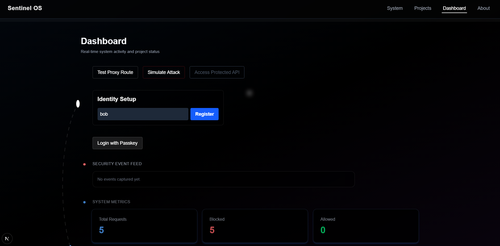
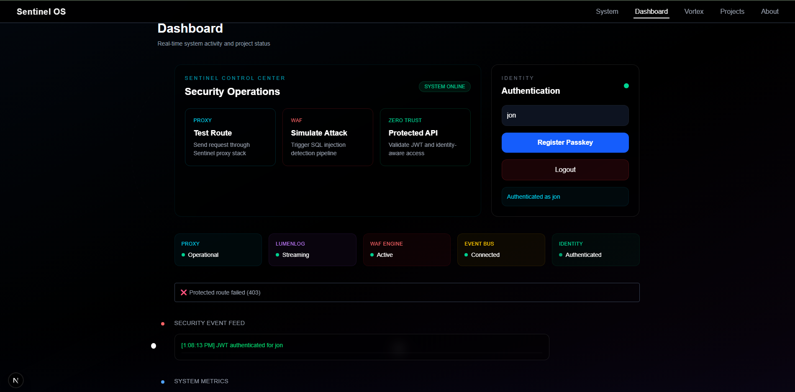
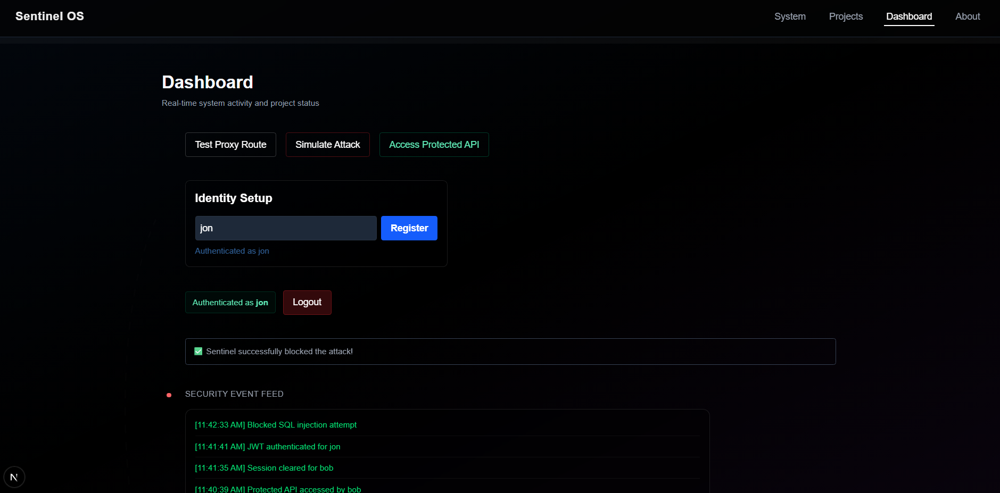
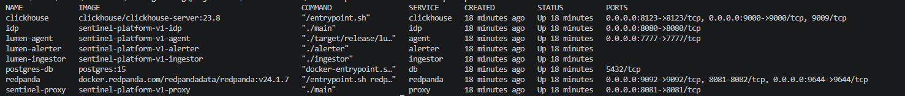
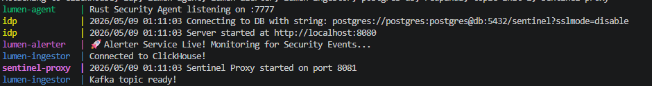
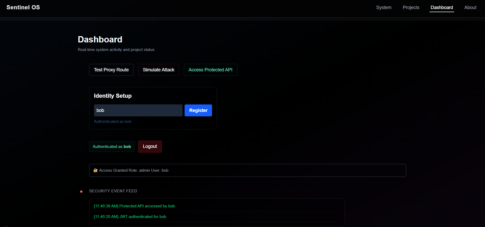

# Sentinel OS v1

A personal systems engineering workspace focused on security, distributed systems, authentication, observability, and infrastructure experimentation.

Sentinel OS v1 combines multiple projects into one environment where services communicate through a hardened proxy layer, real-time telemetry pipelines, and a modern frontend dashboard.

This repository is not meant to be a polished SaaS product.  
It is a hands-on engineering lab built to explore how modern backend systems actually work together.

---

## Projects Inside This Workspace

### Sentinel Platform v1
Zero-trust inspired security platform featuring:

- WebAuthn / Passkey authentication
- JWT issuance and validation
- RBAC-protected routes
- Reverse proxy + WAF filtering
- PostgreSQL-backed identity storage
- Real-time frontend dashboard
- Security event streaming

### Sentinel Console
Modern frontend console built with Next.js and Tailwind.

Features include:

- Live authentication state
- Protected API testing
- Simulated attack controls
- Security event feed
- System visualization
- Project monitoring panels

### LumenLog
Distributed observability pipeline focused on event ingestion and security telemetry.

Built with:

- Go
- Rust
- Kafka
- Docker
- PostgreSQL

---

## Current Architecture

```text
Frontend Console (Next.js)
            │
            ▼
 Sentinel Proxy / WAF
            │
            ▼
      Identity Provider
            │
            ▼
 PostgreSQL + Kafka Events
```

---

## Current Features

### Authentication
- Passkey registration and login
- JWT token generation
- Persistent session state
- Role-based authorization

### Security
- SQL injection detection
- WAF request filtering
- Protected admin routes
- Attack simulation tooling

### Infrastructure
- Dockerized multi-service setup
- Kafka topic initialization
- PostgreSQL persistence
- Service-to-service communication

### Frontend
- Interactive dashboard
- Live event feed
- Real-time system activity
- Visual system flow indicators

---

# Dashboard Preview



The dashboard acts as the central control surface for the system.

It currently supports:
- Authentication workflows
- Protected API access
- Attack simulation
- Security event monitoring
- Project status visualization

---

# RBAC Demonstration



Protected routes are enforced using JWT claims and role validation.

Example:
- `bob` → admin access granted
- `jon` → blocked with HTTP 403

---

# Security Attack Simulation



The WAF layer blocks malicious requests before they reach backend services.

Current demo includes:
- SQL injection pattern detection
- Reverse proxy request inspection
- Automatic rejection of suspicious payloads

---

# Docker Services



The entire environment runs through Docker Compose.

Current services include:
- Sentinel Proxy
- Identity Provider
- PostgreSQL
- Kafka
- Zookeeper
- LumenLog services
- Frontend console

---

# Event Pipeline



Security-related actions generate live events that flow through the system.

Examples:
- Successful authentication
- Access denial
- Session cleanup
- WAF attack detection

---

# Admin Access Flow



Example protected route response for authorized admin users.

---

## Tech Stack

### Backend
- Go
- PostgreSQL
- Kafka
- Docker
- JWT
- WebAuthn

### Frontend
- Next.js
- React
- TailwindCSS
- TypeScript

### Infrastructure
- Docker Compose
- Kafka Topics
- Reverse Proxy Architecture

---

## Running the Project

### 1. Clone the repository

```bash
git clone <repo-url>
cd sentinel-os-v1
```

### 2. Start all services

```bash
docker compose up --build
```

### 3. Start the frontend

```bash
cd sentinel-console
npm install
npm run dev
```

---

## Development Goals

Current focus areas:

- Improved observability metrics
- Better Kafka event visualization
- Expanded WAF rules
- Refresh token lifecycle management
- Centralized logging
- Infrastructure hardening
- Better service health monitoring

---

## Repository Structure

```text
sentinel-os-v1/
│
├── assets/
│   ├── admin-access-success.png
│   ├── dashboard-overview.png
│   ├── docker-services.png
│   ├── event-pipeline.png
│   ├── rbac-access-demo.png
│   └── security-attack-demo.png
│
├── sentinel-console/
│
├── sentinel-platform-v1/
│
└── README.md
```

---

## Notes

This project is actively evolving and intentionally experimental in some areas.

The goal is not just building features, but understanding:
- distributed system design
- authentication internals
- infrastructure orchestration
- secure backend communication
- observability pipelines
- real-world debugging workflows

A large part of this repository is dedicated to learning by building systems end-to-end rather than isolated tutorials.