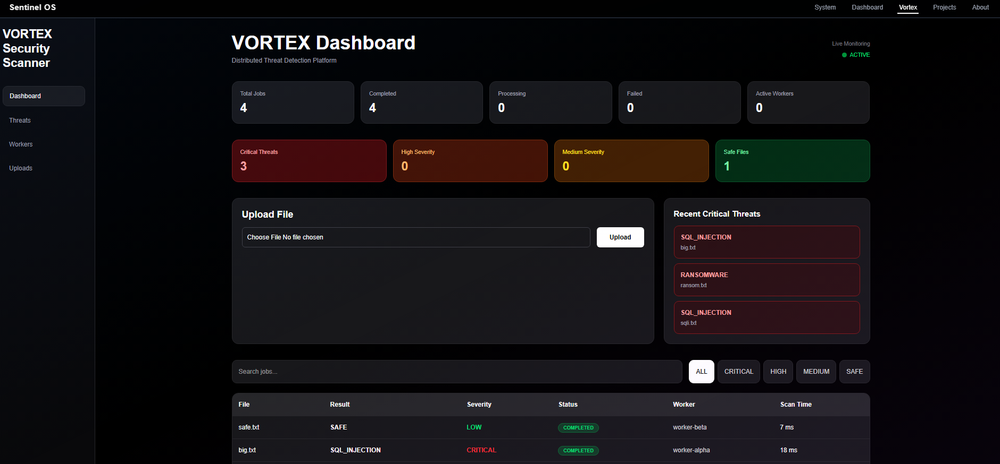

# Sentinel OS v1

A personal systems engineering workspace focused on security, distributed systems, authentication, observability, and infrastructure experimentation.

Sentinel OS v1 combines multiple projects into one environment where services communicate through a hardened proxy layer, real-time telemetry pipelines, and a modern frontend dashboard.

This repository is not meant to be a polished SaaS product.  
It is a hands-on engineering lab built to explore how modern backend systems actually work together.

---

## Projects Inside This Workspace

### Sentinel Platform v1
Zero-trust inspired security platform featuring:

- WebAuthn / Passkey authentication
- JWT issuance and validation
- RBAC-protected routes
- Reverse proxy + WAF filtering
- PostgreSQL-backed identity storage
- Real-time frontend dashboard
- Security event streaming

### Sentinel Console
Modern frontend console built with Next.js and Tailwind.

Features include:

- Live authentication state
- Protected API testing
- Simulated attack controls
- Security event feed
- System visualization
- Project monitoring panels

### LumenLog
Distributed observability pipeline focused on event ingestion and security telemetry.

Built with:

- Go
- Rust
- Kafka
- Docker
- PostgreSQL

### VORTEX
Distributed malware analysis and threat detection service built with Spring Boot.

Features include:

- Asynchronous file scanning
- Threat severity classification
- Worker-based scan processing
- Analytics aggregation APIs
- JWT-protected access through proxy
- PostgreSQL persistence
- Real-time dashboard integration

---

## Current Architecture

```text
Frontend Console (Next.js)
            │
            ▼
 Sentinel Proxy / WAF
            │
     ┌──────┴──────┐
     ▼             ▼
Identity       VORTEX
Provider     Scan Service
     │             │
     └──────┬──────┘
            ▼
 PostgreSQL + Kafka Events
```

---

## Current Features

### Authentication
- Passkey registration and login
- JWT token generation
- Persistent session state
- Role-based authorization

### Security
- SQL injection detection
- WAF request filtering
- Protected admin routes
- Attack simulation tooling
- Threat classification engine
- Malware scan orchestration

### Infrastructure
- Dockerized multi-service setup
- Kafka topic initialization
- PostgreSQL persistence
- Service-to-service communication
- Reverse proxy architecture

### Frontend
- Interactive dashboard
- Live event feed
- Real-time system activity
- Visual system flow indicators
- VORTEX threat dashboard

---

# Dashboard Preview


The dashboard acts as the central control surface for the system.

It currently supports:
- Authentication workflows
- Protected API access
- Attack simulation
- Security event monitoring
- Project status visualization

---

# VORTEX Threat Dashboard



The VORTEX dashboard provides a centralized malware analysis interface integrated directly into Sentinel OS.

Current capabilities include:
- File upload scanning
- Threat severity analytics
- Worker processing visibility
- Scan history tracking
- Critical threat monitoring
- Live scan statistics

---

# RBAC Demonstration


Protected routes are enforced using JWT claims and role validation.

Example:
- `bob` → admin access granted
- `jon` → blocked with HTTP 403

---

# Security Attack Simulation


The WAF layer blocks malicious requests before they reach backend services.

Current demo includes:
- SQL injection pattern detection
- Reverse proxy request inspection
- Automatic rejection of suspicious payloads

---

# Docker Services


The entire environment runs through Docker Compose.

Current services include:
- Sentinel Proxy
- Identity Provider
- PostgreSQL
- Kafka / Redpanda
- LumenLog services
- VORTEX scan service
- Frontend console

---

# Event Pipeline


Security-related actions generate live events that flow through the system.

Examples:
- Successful authentication
- Access denial
- Session cleanup
- WAF attack detection
- Threat scan events
- Malware classification results

---

# Admin Access Flow


Example protected route response for authorized admin users.

---

## Engineering Concepts Explored

- Zero-trust inspired authentication flows
- Distributed event-driven architecture
- Reverse proxy request processing
- WAF request inspection and blocking
- JWT propagation across services
- RBAC authorization enforcement
- Kafka-based telemetry pipelines
- Service-to-service communication
- Distributed worker orchestration
- Real-time frontend observability
- Containerized infrastructure workflows

---

## Tech Stack

### Backend
- Go
- Java
- PostgreSQL
- Kafka / Redpanda
- Docker
- JWT
- WebAuthn
- Spring Boot

### Frontend
- Next.js
- React
- TailwindCSS
- TypeScript

### Infrastructure
- Docker Compose
- Kafka Topics
- Reverse Proxy Architecture
- Distributed Service Communication

---

## Requirements

- Docker + Docker Compose
- Node.js 20+
- npm
- Java 2x
- Go 1.24+

---

## Running the Project

### 1. Clone the repository

```bash
git clone https://github.com/blacAxe/sentinel-os-v1.git
cd sentinel-os-v1
```

### 2. Start backend services

```bash
docker compose up --build
```

### 3. Start the frontend

```bash
cd sentinel-console
npm install
npm run dev
```
--- 

## Development Workflow

A root Makefile is included to simplify local development and service orchestration.

### Start backend services with live logs

```bash
make backend
```

### Start frontend development server

```bash
make frontend
```

### View all backend logs

```bash
make logs
```

### View specific service logs

```bash
make proxy-logs
make vortex-logs
make lumen-logs
make idp-logs
```

### Stop all services

```bash
make down
```

### Remove containers and volumes

```bash
make clean
```

### Check running services

```bash
make status
```

This workflow was added to make debugging distributed services and infrastructure interactions easier during development.

---

## Demo Accounts

| Username | Role  |
|----------|-------|
| bob      | admin |
| jon      | user  |

--- 

## Future Exploration Areas

- OpenTelemetry tracing
- Kubernetes deployment manifests
- Kubernetes orchestration
- Advanced distributed workers
- Expanded telemetry analytics
- Infrastructure scalability experiments

---

## Repository Structure

```text
sentinel-os-v1/
│
├── assets/
│   ├── admin-access-success.png
│   ├── dashboard-overview.png
│   ├── docker-services.png
│   ├── event-pipeline.png
│   ├── rbac-access-demo.png
│   ├── security-attack-demo.png
│   └── vortex-dashboard.png
│
├── sentinel-console/
│
├── sentinel-platform-v1/
│
│   ├── sentinel-proxy/
│   │
│   ├── idp/
│   │
│   └── vortex-java/
│
├── lumenlog/
│
└── README.md
```

---

## Notes

This project is actively evolving and intentionally experimental in some areas.

The architecture intentionally prioritizes learning real backend communication patterns and operational workflows over framework-heavy abstraction.

The goal is not just building features, but understanding:
- distributed system design
- authentication internals
- infrastructure orchestration
- secure backend communication
- observability pipelines
- event-driven architecture
- reverse proxy systems
- malware analysis workflows
- real-world debugging workflows

A large part of this repository is dedicated to learning by building systems end-to-end rather than isolated tutorials.

## Current Limitations

- Observability stack is still evolving
- Kubernetes manifests exist but orchestration is still experimental
- WAF rules are intentionally simplified
- Some services are optimized for experimentation over production scalability